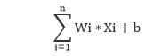
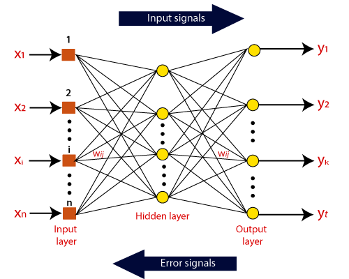

# Artificial Neural Networks:
- These are networks created by mimicking how the brain works. 
- There are three key parts of an ANN. They are:  
1. Input Layer   This layer is responsible for taking the inputs for processing within the neural network. 
2. Hidden Layer   This layer is responsible for all the calculations and detection of underlying patterns of the provided data.  
3. Output Layer   This layer receives all the processed data and displays the received output.  
 The whole ANN is built using various nodes. These nodes are responsible for the working of the Neural Network. All the above mentioned networks have nodes in them which carry out the respective task of each layer. 
An ANN architecture can be considered to be a weighted and directed graph. All activities in an ANN works on the basis of the calculated sum of weights with added bias of the input nodes. The formula for calculating this is:    
**Activation Function**: This is an important function within an ANN. It is responsible for deciding whether the nodes of the hidden layer must be fired or not, based on the calculated weight of the input node. Only the nfired nodes make it to the output layer.
- The association of the neuron outputs with neuron inputs can be assumed to be directed edges with weights.
- The Artificial Neural Network receives the input signal from the external source in the form of a pattern and image in the form of a vector.

